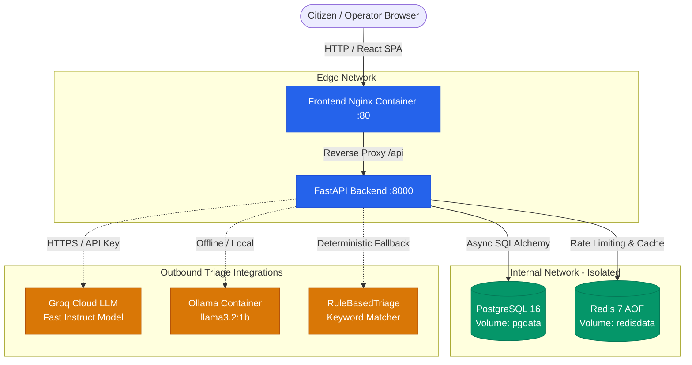

# CivicPulse ⚡

[](https://github.com/stackmussa/civicpulse/actions/workflows/ci.yml)
[](LICENSE)
[](https://www.python.org/)
[](https://react.dev/)
[](Dockerfile)
[](backend/tests)

> **Municipal Complaint Intake, Automated AI Triage, and Operations Platform.**  
> Built for CS4032 Software Construction & Design (Assignment 01).

---

## 1. The Problem

Every municipality faces the same operational bottleneck: a citizen submits *"burst water main flooding street 12 since morning, water entering ground floors"* into an undifferentiated free-text intake queue. When hundreds of requests arrive concurrently, urgent structural emergencies sit buried behind minor complaints.

Naive dropdown category selectors fail because citizens misclassify, pick "Other", or cannot objectively evaluate urgency. **CivicPulse** resolves this by pairing free-text intake with a **resilient, pluggable AI triage pipeline** that validates complaints, classifies category and priority in milliseconds, generates a concise summary, and surfaces telemetry on a real-time operations dashboard.

---

## 2. System Architecture



### Architectural Highlights:
- **Build-Once-Deploy-Many:** Frontend proxies `/api` via Nginx; zero baked-in backend URLs ([ADR 0002](docs/adr/0002-frontend-runtime-config.md)).
- **Network Segmentation:** Frontend container physically cannot reach PostgreSQL or Redis (`internal: true`).
- **Resilient AI Pipeline:** Hard 10s timeout, jittered retries, SHA-256 hash caching, and seamless fallback to `RuleBasedTriage` (`triaged_by: rules:fallback`).
- **Distributed Rate Limiting:** Redis-backed Lua token counter keyed by client IP (`X-Forwarded-For` aware).

---

## 3. Quickstart (One Command)

From a clean clone:

```bash
# 1. Clone repository
git clone https://github.com/stackmussa/civicpulse.git
cd civicpulse

# 2. Configure environment
cp .env.example .env

# 3. Boot all 5 containers
docker compose up -d

# 4. Run database migrations & idempotent seed (31 Urdu complaints)
docker compose exec backend alembic upgrade head
docker compose exec backend python scripts/seed.py
```

Open your browser:
- **Web UI:** [http://localhost:5173](http://localhost:5173)
- **API Documentation (Swagger):** [http://localhost:8000/docs](http://localhost:8000/docs)
- **Prometheus Metrics:** [http://localhost:8000/metrics](http://localhost:8000/metrics)

---

## 4. API Specification

| Method | Endpoint | Description | Status Codes |
|---|---|---|---|
| `POST` | `/api/complaints` | Submit free-text complaint; runs AI triage and persists record | `201`, `400`, `429` |
| `GET` | `/api/complaints/{id}` | Retrieve complaint by UUID | `200`, `404` |
| `GET` | `/api/complaints` | Paginated list with category, priority, and status filters | `200` |
| `PATCH` | `/api/complaints/{id}/status` | Advance lifecycle status via explicit state machine | `200`, `404`, `409` |
| `GET` | `/api/stats` | Cached aggregate metrics (`X-Cache: HIT/MISS`, 30s TTL) | `200` |
| `GET` | `/api/meta/providers` | Active triage provider and recent latency/fallback telemetry | `200` |
| `GET` | `/health` | Liveness probe (does **not** touch database) | `200` |
| `GET` | `/ready` | Readiness probe (verifies Postgres & Redis connectivity) | `200`, `503` |
| `GET` | `/metrics` | Prometheus exposition format (request counts, triage latencies) | `200` |

---

## 5. Automated Verification & Testing

```bash
# Run backend test suite (18 tests, unit + integration + fallback)
docker compose exec backend pytest --cov=app --cov-fail-under=65

# Run frontend component test suite (5 Vitest component tests)
cd frontend && npm test

# Run submission pre-flight validation lint
python scripts/check_submission.py
```

---

## 6. Architecture Decision Records (ADRs)

Detailed architectural justifications are preserved in [`docs/adr/`](docs/adr/):
- **[ADR 0001: Triage Provider Protocol & Factory Abstraction](docs/adr/0001-provider-interface.md)**
- **[ADR 0002: Build-Once-Deploy-Many Runtime Configuration](docs/adr/0002-frontend-runtime-config.md)**
- **[ADR 0003: Immutable Container Deployments by Commit SHA](docs/adr/0003-deploy-by-sha.md)**
- **[ADR 0004: PII Governance and Hosted LLM Data Privacy](docs/adr/0004-pii-and-data-governance.md)**

---

## 7. Authors & Collaboration
Developed collaboratively by:
- **Mussa Raza** ([@stackmussa](https://github.com/stackmussa))
- **Nisar Ahmad** ([@malik-nisarahmad](https://github.com/malik-nisarahmad))
